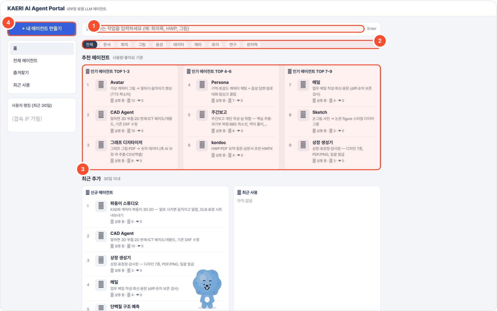
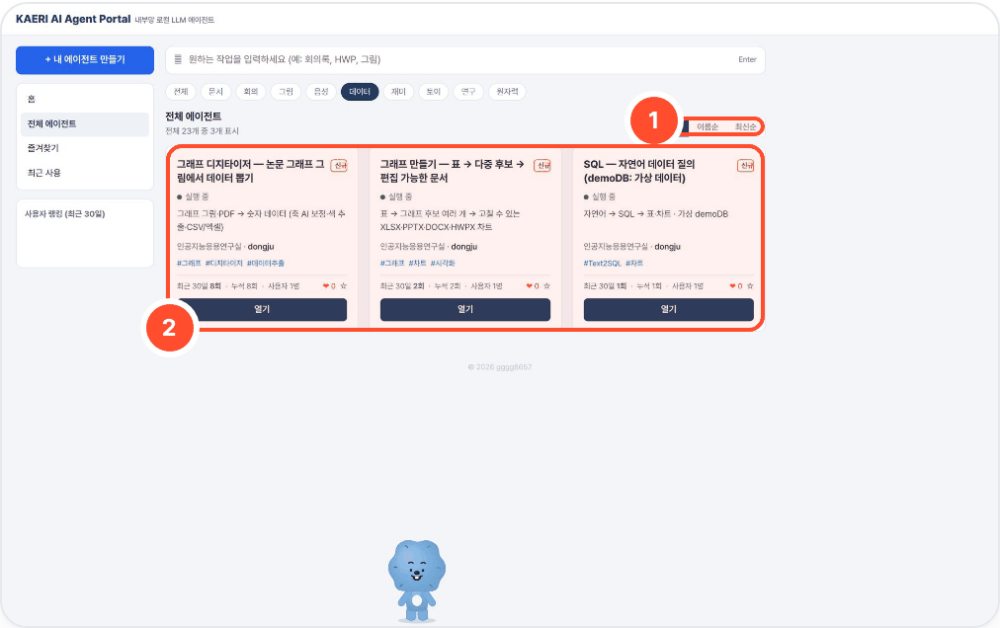
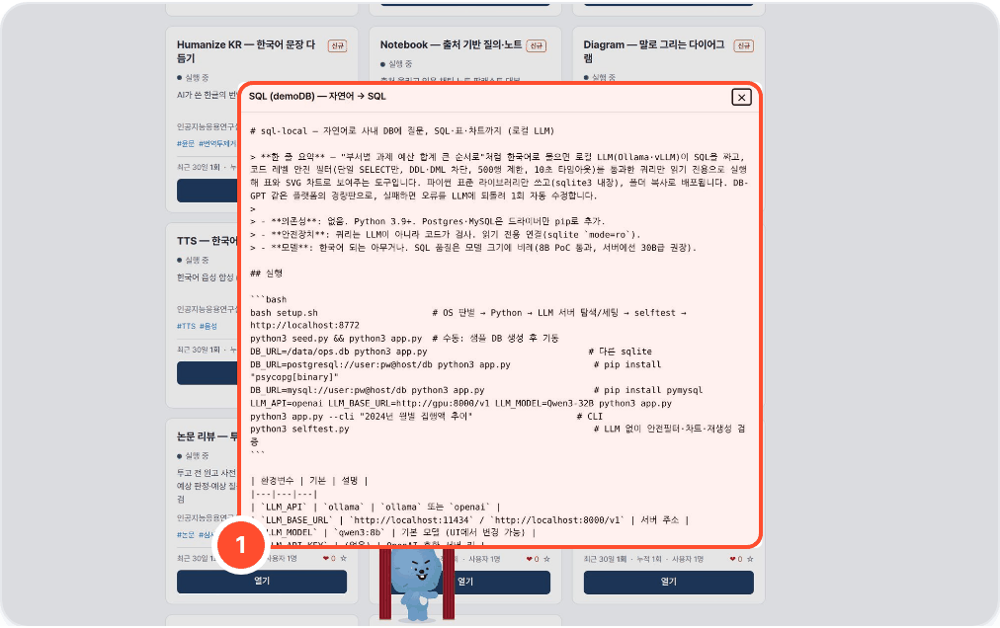
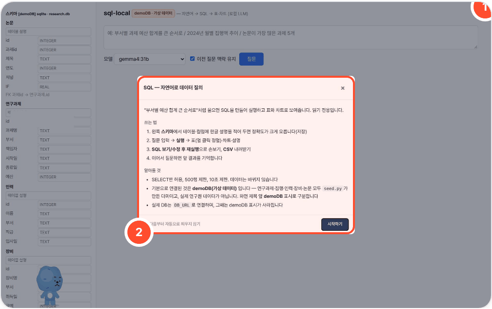

# agent-page-portal — 에이전트 페이지 포털

> **한 줄 요약** — 같은 상위 폴더에 나란히 둔 로컬 LLM 도구 24개(목록 노출 23개)를 한 화면에 모은 포털. 검색·카테고리로 도구를 찾고, `/t/<도구>/` 프록시로 UI를 열고, README·사용법 팝업·시작/중지·사용 통계를 한곳에서 다룹니다. 파이썬 표준 라이브러리만.
> 각 도구는 **따로따로 별도 저장소**로 공개되어 있고, 이 저장소는 그 도구들을 묶어 띄우는 포털입니다.



## 사용 방법
번호는 화면의 번호 상자와 같습니다.

1. **검색**(홈 ①) — 도구 이름·설명·태그를 한 번에 찾습니다(예: 회의록, HWP, 그림).
2. **카테고리 칩**(홈 ②) — 문서·회의·그림·음성·데이터·재미·토이·연구·원자력으로 목록을 좁힙니다.
3. **홈 요약**(홈 ③) — 인기 TOP·신규·최근 사용 카드에서 바로 고릅니다. 사용자 랭킹은 접속 IP를 가린 채 표시됩니다.
4. **내 에이전트 만들기**(홈 ④) — 새 도구 등록 안내로 연결됩니다.
5. **전체 에이전트** 목록에서 정렬(이름순·최신순, 아래 ①)과 카테고리 필터로 카드를 고르고 **열기**(아래 ②) — 또는 `http://<포털>:8700/t/<도구폴더>/` 로 바로 갑니다.
6. 카드의 **README**는 저장소 설명을, 도구 화면 오른쪽 위 **?** 는 `guides/<도구폴더>.md` 짧은 사용법을 엽니다.

<p>


</p>



## 예시
SQL 도구로 프록시 진입(같은 세션 캡처): `http://localhost:8700/t/sql-local/` → demoDB(가상 데이터)에 질문 "부서별 과제 예산 합계를 큰 순서로" →

```sql
SELECT "부서", SUM("예산") AS "예산합계"
FROM "연구과제" GROUP BY "부서"
ORDER BY "예산합계" DESC LIMIT 500
```

5행 · gemma4:31b · 표·SVG 차트 생성. 각 도구는 자체 `app.py`·`ui.html` 로 동작하고, SSE·파일 다운로드도 포털이 그대로 전달합니다.

## 포털이 하는 일
- **목록·검색** — `tools.json`(요청마다 다시 읽음)에 적힌 도구를 카드로 보여 줌. "+ 내 에이전트 만들기"로도 추가. `"hidden": true` 면 목록에서 숨김(프록시는 됨).
- **시작/중지** — 각 도구 폴더의 `setup.sh` 를 `PORT`·`WORKSPACE` 를 넘겨 실행. `python3 portal.py start-all` / `stop-all`.
- **단일 진입점(프록시)** — 모든 도구를 `http://<포털>:8700/t/<도구폴더>/` 로 리버스 프록시(SSE·파일 다운로드 포함). 포트 하나만 열면 되고, 도구 UI 는 상대경로만 씀. 직접 포트 주소는 `url_direct`(`PORTAL_HOST=<server-ip>`).
- **사용법 팝업** — 프록시하는 도구 첫 화면에 `guides/<도구폴더>.md` 를 오른쪽 위 **?** 팝업으로 붙임(포털 자체는 `guides/portal.md`).
- **통계·피드** — `AGENT_DATA/portal.db` sqlite 하나(WAL)에 열기·좋아요·피드 글·사용자 랭킹(IP 또는 `X-Forwarded-User` 헤더). 즐겨찾기·최근 사용만 브라우저 localStorage.
- **점검** — `bash audit.sh`: 도구별 CDN 유출·포트 중복·LICENSE/NOTICE·selftest.

## 연결된 도구 (24개, `tools.json` 기준)

| 이름 | 폴더 | 포트 | 분류 | 하는 일 | 저장소 | 목록 |
|---|---|---|---|---|---|---|
| Humanize KR | `humanize-kr-local` | 8765 | 문서 | AI가 쓴 한글의 번역투·상투구 제거 | [gggg8657/humanize-kr-local](https://github.com/gggg8657/humanize-kr-local) | 보임 |
| kordoc | `kordoc-local` | 8766 | 문서 | HWP·PDF 요약·질문·공문서 초안 HWPX | [gggg8657/kordoc-local](https://github.com/gggg8657/kordoc-local) | 보임 |
| Notebook | `notebook-local` | 8769 | 문서 | 출처 올리고 인용 채팅·노트·팟캐스트 대본 | [gggg8657/notebook-local](https://github.com/gggg8657/notebook-local) | 보임 |
| Writer | `writer-local` | 8773 | 문서 | 건배사·경조사·축사·공지문 패턴 글쓰기 | [gggg8657/writer-local](https://github.com/gggg8657/writer-local) | 보임 |
| Meeting | `meeting-local` | 8767 | 회의 | 녹음 → 화자 분리 → 회의록·인사이트 | [gggg8657/meeting-local](https://github.com/gggg8657/meeting-local) | 보임 |
| Diagram | `diagram-local` | 8768 | 그림 | 말로 설명하면 다이어그램 | [gggg8657/diagram-local](https://github.com/gggg8657/diagram-local) | 보임 |
| Sketch | `sketch-local` | 8774 | 그림 | 손그림 사진 → 논문 figure 스타일 다이어그램 | [gggg8657/sketch-local](https://github.com/gggg8657/sketch-local) | 보임 |
| TTS | `tts-local` | 8771 | 음성 | 한국어 음성 합성 (OpenAI 음성 API 호환) | [gggg8657/tts-local](https://github.com/gggg8657/tts-local) | 보임 |
| SQL (demoDB) | `sql-local` | 8772 | 데이터 | 자연어 → SQL → 표·차트 · **기본 DB 는 가상(합성) demoDB** — 실제 DB 는 운영자가 연결 | [gggg8657/sql-local](https://github.com/gggg8657/sql-local) | 보임 |
| 팀 밸런스 맵 | `saju-local` | 8775 | 재미 | 사주·MBTI 협업 궁합 (워크숍용) | [gggg8657/saju-local](https://github.com/gggg8657/saju-local) | 보임 |
| Persona | `persona-local` | 8776 | 토이 | 기억·호감도 캐릭터 채팅 + 음성 답변·말로 대화·립싱크 클립 | [gggg8657/persona-local](https://github.com/gggg8657/persona-local) | 숨김 |
| Avatar | `avatar-local` | 8777 | 그림 | 가상 캐릭터 그림 → 말하기(Wan2.2-S2V)·움직이기(Wan2.2-I2V) 영상, 목소리는 tts-local | [gggg8657/avatar-local](https://github.com/gggg8657/avatar-local) | 보임 |
| CAD Agent | `agent-cad-local` | 8778 | 그림 | 말하면 3D 부품·2D 판재·ICT 배치도/개황도, 기존 DXF 수정 | [gggg8657/agent-cad-local](https://github.com/gggg8657/agent-cad-local) | 보임 |
| 상장 생성기 | `award-local` | 8779 | 문서 | 상장·표창장·감사장 — 디자인 7종, PDF/PNG, 일괄 발급 | [gggg8657/award-local](https://github.com/gggg8657/award-local) | 보임 |
| 메일 | `mail-local` | 8780 | 문서 | 업무 메일 작성·회신·윤문 (diff·숫자 보존 검사) | [gggg8657/mail-local](https://github.com/gggg8657/mail-local) | 보임 |
| 단백질 구조 예측 | `protein-local` | 8781 | 연구 | 서열 → 3D 구조·pLDDT·PAE, 결합 친화도 순위, 서열 설계 (Boltz-2 + ProteinMPNN, 폐쇄망) | [gggg8657/protein-local](https://github.com/gggg8657/protein-local) | 보임 |
| 그래프 디지타이저 | `digitizer-local` | 8783 | 데이터 | 그래프 그림·PDF → 숫자 데이터 (축 AI 보정·색 추출·CSV/엑셀) | [gggg8657/digitizer-local](https://github.com/gggg8657/digitizer-local) | 보임 |
| 논문 리뷰 | `review-local` | 8782 | 문서 | 투고 전 원고 사전 심사 — 인용 확인된 심사 지적·예상 판정·예상 질문 + 그림·인용·약어·수치 기계 점검 | [gggg8657/review-local](https://github.com/gggg8657/review-local) | 보임 |
| 그래프 | `chart-local` | 8786 | 데이터 | 표 → 그래프 후보 여러 개 → 고칠 수 있는 XLSX·PPTX·DOCX·HWPX 차트 | [gggg8657/chart-local](https://github.com/gggg8657/chart-local) | 보임 |
| 차폐 계산기 | `shield-local` | 8784 | 원자력 | 방사선 차폐·선량 간이 계산 — 점선원 감마, 축적인자, 필요 두께 역산, 누적선량 | [gggg8657/shield-local](https://github.com/gggg8657/shield-local) | 보임 |
| 배터리 | `battery-local` | 8785 | 연구 | PyBaMM 배터리 성능·수명(열화) 예측 — C-rate·충전·SOH·EOL·LLI/LAM | [gggg8657/battery-local](https://github.com/gggg8657/battery-local) | 보임 |
| 주간보고 | `weekly-local` | 8788 | 문서 | 주간보고 개인 작성·실 취합 — 핵심 주황·과기부 파랑·BBS 취소선, 약어 풀이, HWPX·DOCX | [gggg8657/weekly-local](https://github.com/gggg8657/weekly-local) | 보임 |
| 파동이 | `padong-local` | 8789 | 토이 | KAERI 캐릭터 파동이 3D·2D — 말로 시키면 움직이고 말함, 날짜별 옷, 포털 모든 화면을 돌아다니는 펫 | [gggg8657/padong-local](https://github.com/gggg8657/padong-local) (비공개 — 캐릭터 권리는 KAERI·허쉬위쉬) | 보임 |
| 그림 생성 | `image-local` | 8792 | 그림 | 말로 그리고 말로 고치는 범용 그림 도구 — Qwen-Image-2512 · Qwen-Image-Edit-2509 | [gggg8657/image-local](https://github.com/gggg8657/image-local) | 보임 |

'목록'은 `tools.json` 의 `hidden` 값입니다(현재 값 그대로). 숨긴 도구는 일반 포털 목록에서만 빠지고, 테스트 포털(`SHOW_HIDDEN=1`)에서는 보입니다.

## 도구가 연결되는 방식

```
브라우저 ──▶ portal.py :8700 ──/t/<dir>/──▶ 127.0.0.1:<port> (각 도구 app.py)
                │  시작할 때 넘기는 환경변수: PORT, WORKSPACE=$AGENT_DATA/<dir>, 그리고 포털이 받은 환경 전부
                └─ 첫 화면 HTML 에 guides/<dir>.md 사용법 팝업(?) 삽입
도구들 ──▶ LLM_BASE_URL (로컬 Ollama, 기본 gemma4:31b)
persona / notebook / avatar ──▶ TTS_BASE_URL(tts-local) · STT_BASE_URL(meeting-local) · AVATAR_URL(avatar-local)
```

- **데이터 한곳에** — `AGENT_DATA`(기본 `../_data`) 아래에 `portal.db` 와 각 도구의 작업 폴더(`_data/<도구>/…`)가 모입니다. 포털이 도구를 띄울 때 `WORKSPACE=$AGENT_DATA/<도구>` 를 넘기고, 모든 도구가 그 변수를 읽습니다. 백업은 이 폴더 하나. (이 폴더는 어느 저장소에도 올리지 않습니다.)
- **LLM** — `start-portal.sh` 가 `LLM_API=ollama LLM_BASE_URL=http://127.0.0.1:11436 LLM_MODEL=gemma4:31b MODEL=… VISION_MODEL=…` 를 export 하고 포털이 그대로 도구에 물려 줍니다. 모든 도구는 OpenAI 호환/Ollama API 로 이 주소를 부릅니다(외부 인터넷 불필요).
- **도구끼리 연결** — `start-portal.sh` 가 `TTS_BASE_URL=http://127.0.0.1:8771/v1`(tts-local), `STT_BASE_URL=http://127.0.0.1:8767/v1`(meeting-local 받아쓰기), `AVATAR_URL=http://127.0.0.1:8777/api/run`(avatar-local 립싱크) 와 `TTS_VOICE/TTS_MODEL/…_DEVICE` 를 넘깁니다. 그 밖에 chart·review·weekly·meeting 은 옆 폴더 `../kordoc-local` 의 kordoc 을 (있으면) 불러 HWP/HWPX 를 처리합니다.

## 전체 설치 — 도구를 나란히 clone

포털은 `<상위폴더>/<도구>/` 구조를 전제로 하므로 모든 저장소를 같은 상위 폴더에 clone 합니다.

```bash
mkdir agent-page && cd agent-page
git clone https://github.com/gggg8657/agent-page-portal
bash agent-page-portal/scripts/clone-all.sh     # tools.json 의 도구 전부 clone(있으면 pull) + portal 심볼릭 링크
```

손으로 하려면: `for d in humanize-kr-local kordoc-local notebook-local writer-local meeting-local diagram-local sketch-local tts-local sql-local saju-local persona-local avatar-local agent-cad-local award-local mail-local protein-local digitizer-local review-local chart-local shield-local battery-local weekly-local image-local; do git clone https://github.com/gggg8657/$d; done`

그다음 각 도구의 README 대로 의존성(`bash <도구>/setup.sh`)과 로컬 Ollama(+ `ollama pull gemma4:31b`)를 준비합니다.

## 실행

```bash
bash agent-page-portal/scripts/start-portal.sh        # 운영 포털 :8700 (모든 주소에서 열림) — Ollama 확인 → LLM·도구 연결 환경변수 export → portal.py
bash agent-page-portal/scripts/start-test-portal.sh   # 본인 테스트 포털 :8701, HOST=127.0.0.1, SHOW_HIDDEN=1 (숨긴 도구도 보임, SSH 터널로 접속)
bash agent-page-portal/scripts/autostart.sh           # 재부팅 후 한 번: 포털 + tools.json 의 모든 도구 기동 (~/.zshrc 에서 백그라운드 호출용)
python3 portal.py                 # 포털만 직접 — http://localhost:8700
python3 portal.py start-all       # tools.json 의 설치된 도구 전부 기동 (각 폴더 setup.sh, PORT 전달)
python3 portal.py stop-all
bash audit.sh                     # 전체 점검: CDN 유출·포트 중복·LICENSE/NOTICE·selftest
```

| 환경변수 | 기본 | 설명 |
|---|---|---|
| `PORT` | 8700 | 포털 포트 (테스트 포털 8701) |
| `HOST` | (모든 주소) | `127.0.0.1` 이면 서버 안에서만 열림 |
| `SHOW_HIDDEN` | 없음 | `1` 이면 `hidden: true` 도구도 목록에 |
| `AGENT_DATA` | `../_data` | 포털 DB + 모든 도구 작업 폴더 루트 |
| `PORTAL_HOST` | 없음 | 카드의 '직접 주소'에 쓸 서버 주소(`<server-ip>`) |
| `OLLAMA_PORT` / `LLM_MODEL` | 11436 / gemma4:31b | `scripts/start-*.sh` 가 읽음 |

`scripts/` 의 세 스크립트는 원래 상위 폴더(`agent-page/`)에 있던 `start-portal.sh` · `start-test-portal.sh` · `autostart.sh` 의 사본입니다(상위 폴더로 `cd` 하도록만 바꾸고, 서버 주소는 `<server-ip>` 로 가림). 상위 폴더 쪽 원본도 그대로 쓸 수 있습니다.
`~/.local/ollama-gpu/start.sh` 는 작성자 서버의 Ollama 기동 스크립트로, 없으면 건너뜁니다 — Ollama 는 각자 띄우세요.

## 출처·감사 (Credits)

- 파이썬 표준 라이브러리만 씁니다. 연결된 각 도구가 쓰는 오픈소스·모델·데이터의 출처는 위 표의 각 저장소 README 'Credits' 와 `NOTICE` 에 있습니다.
- 기본 LLM: [Ollama](https://github.com/ollama/ollama) (MIT) + Google [Gemma](https://ai.google.dev/gemma) `gemma4:31b` (모델 이용 조건은 Gemma 배포처 참고) — 포털은 환경변수로 넘겨 줄 뿐 동봉하지 않습니다.

저작권 표기는 `NOTICE` 를 보세요.

All rights reserved. 저작자의 허락 없이 복제·배포·개작할 수 없습니다.

### GPU 나눠 쓰기
GPU 를 도구마다 미리 정해 두지 않습니다. 포털 기동 스크립트는 모든 GPU(`CUDA_VISIBLE_DEVICES=0,1,2,3` — 셸에 다른 값이 있어도 덮어씀, 줄이려면 `AGENT_GPUS=2,3`)를 도구에 넘기고, 각 도구가 **모델을 올리는 그 순간 여유 메모리가 가장 큰 GPU 1장**(같으면 덜 바쁜 쪽)을 고릅니다. 각 도구 저장소의 `gpu_pick.py`(stdlib, 같은 파일 복사)가 `nvidia-smi` 로 고릅니다.

| 도구 | 언제 고르나 | 다 쓰면 |
|---|---|---|
| protein-local | 예측·설계 작업마다 | 작업 끝나면 프로세스 종료 |
| avatar-local 스튜디오(Qwen-Image-2512 약 60GB · Wan2.2 I2V-A14B 약 48GB) | 모델을 올릴 때마다(모델 바꿀 때도 새로) | 10분 안 쓰면 내림 |
| avatar-local 말하기(Wan2.2-S2V 약 60GB)·립싱크(SadTalker) | 실행마다(서브프로세스) | 실행 끝나면 반환 |
| tts-local(MeloTTS)·meeting-local(Whisper) | 처음 쓸 때 | 10분 안 쓰면 내림 → 다음에 다시 고름 |
| Ollama(gemma4:31b) | Ollama 스케줄러가 여유 VRAM 보고 배치 | `OLLAMA_KEEP_ALIVE` |

- 어느 GPU 에 올랐는지는 각 도구 로그(`server.log`·`studio.log`)와 진행 메시지에 `GPU 2 (여유 80GB) 에서 로드` 처럼 나옵니다.
- 환경변수: `GPU_POOL=2,3`(이 GPU 들만 후보로), `GPU_IDLE_UNLOAD_S=600`(안 쓰면 내리는 초, 0 이면 안 내림).
- 꼭 고정해야 할 때만(예외용): `tools.json` 의 그 도구에 `"gpus": "0"` 을 적으면 포털이 그 도구를 `CUDA_VISIBLE_DEVICES=<값>` 으로 띄워, 그 안에서만 고릅니다.

> portrait-local(LivePortrait)은 2026-10-06 포털에서 뺐습니다 — 얼굴 인식 모델(InsightFace)이 비상업 연구용 라이선스라 기술이전 등에 걸릴 수 있고 효용이 낮아서. 저장소 [gggg8657/portrait-local](https://github.com/gggg8657/portrait-local) 은 남겨 둡니다.
